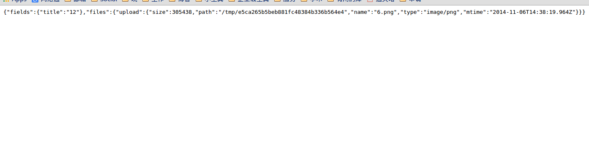

<!-- gliding -->
<!-- Copyright(c) 2014 Xinyu Zhang bevis@mail.ustc.edu.cn -->
<!-- MIT Licensed -->

# Gliding

## Overview
Gliding is a web framework on nodejs, minimal (only 400 or more lines of code) and modular, extremely easy to be extended. 


This is __the first javascript program__ I write, I just start to learn javescript and nodejs, and want to try it on the server side programming. But soon I found the [__callback hell problem__](http://callbackhell.com/) is really annoying, making your code more and more unreadable as you code along. 


>However, since you use nodejs, you could not escape that, that's the beautiful way that node deal with async IO, only with callback and event we need not to worry about those complex lock and sync, while in the same time making cpu and io working more parallel and gain more efficiency.

So after thinking quite a long time, I come up with a simple idea to try to make lives a little bit easier.

Also I have some tastes on [angularjs](https://github.com/angular), so I want it to look like it.


## Usage 

### flow
- register components as provider or factory
- register handler that use components, just like
```js
function($scope, $form, $db, $utility){
//  $form.fields, $db.user, $utility(x,y,z) 
}
```
- run


### A quick example
Here is a example shows how to use inject a `$form` service to the framework, and then use it:

*in the index.js file*
```js
var gliding = require('gliding');
var myServer = new gliding.Server(options); // need to set options, so to find the components that would get injected into the server, also change Port or something like that
myServer.Run(); 
```
*inject components into the server, (in a seperate file)*
```js
var gliding = require('gliding');
var md = new gliding.Module(); 
var form = new formidable.IncomingForm();
var f = {
    callback: function(data, options, fun) { //must have interface
        form.parse(data.HTTP.Request, function(err, fields, files) {
             fun({'fields': fields, 'files': files });
        });
    }
};
md.provider.register('$form', f); // inject the service

var f6 = function($scope, $form) { //use the service here, and no callback anymore
    $scope.HTML = JSON.stringify($form); //$form = {fields:stuff, files:stuff}
};
var f7 = function($scope) {
    $scope.HTML = '<html> <title>test form</title> <body>' +
        '<form action="/upload" enctype="multipart/form-data" method="post">' +
        '<input type="text" name="title"><br>' +
        '<input type="file" name="upload" multiple="multiple"><br>' +
        '<input type="submit" value="Upload">' +
        '</form>' +
        '</body></html>';
};
md.handler.register("GET", "/form", [f7,]); 
md.handler.register("POST", "/upload", [f6,]);
exports.myModule = md;
```

Then `node index.js`, the server is running at localhost:8080. 

#### result

after upload a file, print the json on the page.


### Documentation
Would completed tomorrow and if you could not wait, in the [example](https://github.com/BenBBear/gliding/tree/master/example) fold that you find __all usages__.
#### Options 
`var server = new gliding.Server(options)` <- here

#### Module()
`var md = new gliding.Module();` <- here

#### provider
`md.provider.register('$form', f);` <- here

#### factory
`md.factory.register('dbfactory',obj)` <- here (not in this example)

#### handler
`md.handler.register("GET", "/form", [f7,]);` <- here


#### Templating
`$scope.HTML = JSON.stringify($form);` <- here

## How it works
### Core Code
It works based a simple idea. The following is the core of this framework:

```js
  function fall(sv) {
            if (sv !== undefined)
                realArgList.push(sv);
            if (argQueue.length === 0) {
                if (argQueue.stage === undefined) {
                    fun2arg();
                    fall();
                } else {
                    if (funQueue.length === 0) {
                        argQueue.stage.apply(this, realArgList);
                        end();
                    } else {
                        var retureValue = argQueue.stage.apply(this, realArgList);
                        if (retureValue !== false) {
                            realArgList = [$scope];
                            fun2arg();
                            fall();
                        } else {
                            funQueue = [];
                            end();
                        }
                    }
                }
            } else {
                var nowArg = dequeue(argQueue),
                    nowService = service[nowArg];
                if (hasCallback(nowService)) {
                    nowService.callback($scope, options, fall);
                } else {
                    realArgList.push(nowService);
                    fall();
                }
            }
        }
fall();
```
### Explain 

Once it start to `fall`, it would `fall` into a service that you register which has `callback`, those don't have callback wouldn't be fall into but just:

```js 
  realArgList.push(nowService); // notice that the realArgList begins with $scope in it.
```

but it would pass fall as argument to the callback, so in the callback, it would be call again, just like the previous example
```js
   form.parse(data.HTTP.Request, function(err, fields, files) {
       fun({'fields': fields, 'files': files });
   });
```
and then, we back to `fall`, save this value to our list
```js
            if (sv !== undefined)
                realArgList.push(sv);
```
once we `fall` all the services that the arguments of this function correspond to, it would call this function with 
```js
                        argQueue.stage.apply(this, realArgList); // the current function is in argQueue.stage
```
and then refill the `argQueue`, pop the `funQueue`, and `fall` again
```js
realArgList = [$scope];
fun2arg();
fall();
```
util the end;
```js
 if (funQueue.length === 0) {
    //    final apply
    end();
 }
```

##  Current State

### ready to use?
No, I think, it haven't been tested a lot yet, also it lacks a lot of other features maybe, so still a long way to go.

### development

I am trying to apply to graduate school these days, and I have serveral projects and courses at the same time, so I'm very very busy. So __gliding__ wou't be developed so actively like I did the recent three days. But I would still work on it, and will have more time on it when my other burning priorities pass.


